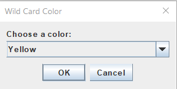

# Uno Game GUI

## Overview

This is a Java-based graphical user interface (GUI) for the classic card game UNO. The game allows multiple players, including computer-controlled players, to play a full game of UNO with standard rules. The application provides an interactive experience with visual representations of the cards, player hands, and game actions.

## Features

- **Multiplayer Support**: Playable by up to 4 players.
- **Computer-Controlled Opponents**: Play against AI opponents.
- **Full UNO Deck Support**: Includes all standard UNO cards, such as number cards, action cards, and wild cards.
- **Graphical Interface**: User-friendly GUI to display cards, the top card, player hands, and game history.
- **Wild Card Color Selection**: Interactive dialog for choosing the color when a wild card is played.
- **Move History**: Displays a log of all moves made during the game.

## Screenshots

### Wild Card Color Selection


### Game Interface


## Game Rules

- **Objective**: Be the first player to score 500 points. Points are scored by getting rid of all your cards before your opponents.
- **Starting the Game**: Each player is dealt 7 cards. The top card of the deck is turned over to start the discard pile.
- **Playing Cards**: Players must match a card in their hand to the card on the top of the discard pile by color or number. If they cannot play a card, they must draw one from the deck.
- **Special Cards**:
  - **Skip**: Skips the next player's turn.
  - **Reverse**: Reverses the direction of play.
  - **Draw Two**: Next player draws two cards and loses a turn.
  - **Wild**: Player declares the next color to be matched.
  - **Wild Draw Four**: Player declares the next color to be matched, and the next player draws four cards and loses a turn.
- **Winning a Round**: The first player to get rid of all their cards wins the round. Points are scored based on the cards remaining in the opponents' hands.
- **Scoring**: Number cards are worth their face value, special cards have specific points (Skip, Reverse, and Draw Two are worth 20 points; Wild and Wild Draw Four are worth 50 points).

## Code Structure

- **UnoGameGUI.java**: Main class for the game GUI, responsible for initializing the game and handling user interactions.
- **Card.java**: Class representing a single card, with attributes for color and type.
- **Deck.java**: Class representing the deck of cards, including methods for shuffling and dealing.
- **Player.java**: Class representing a player, managing the player's hand and actions.
- **GameEngine.java**: Class containing the game logic, handling turn progression and rule enforcement.

## Development and Contribution

### Setting Up the Development Environment

1. Ensure you have Java Development Kit (JDK) installed.
2. Clone the repository and navigate to the project directory.
3. Compile the project using the `javac` command.

### Adding New Features

To add new features or modify existing ones, follow these steps:

1. **Identify the Relevant Class**: Determine which class or classes need to be modified.
2. **Implement Your Changes**: Make your changes in the respective Java files.

### Submitting Changes

1. **Fork the Repository**: Create a fork of the repository on GitHub.
2. **Create a Branch**: Make a new branch for your feature or bug fix.
    ```sh
    git checkout -b feature-name
    ```
3. **Commit Your Changes**: Commit your changes with a descriptive message.
    ```sh
    git commit -m "Description of the feature or fix"
    ```
4. **Push to Your Fork**: Push your changes to your forked repository.
    ```sh
    git push origin feature-name
    ```
5. **Submit a Pull Request**: Go to the original repository and submit a pull request.

## Contributing

If you would like to contribute to this project, please follow the steps outlined above for submitting changes. Make sure to adhere to coding standards and include appropriate documentation for any new features or changes.
